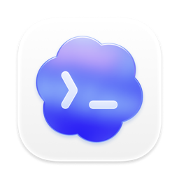

<div align="center">

# 🧬 Distilly

**Früher: Colleague Skill / colleague-skill.**


### **Distill how they think.**

[](../../LICENSE)
[](https://python.org)
[](https://agentskills.io)
[](https://github.com/titanwings/colleague-skill/stargazers)

[](https://discord.gg/NVX66RxWZv)

<br>

<table>
<tr><td align="left">

🧑‍💼 &nbsp;Dein Kollege hat gekündigt, dein Mentor hat seinen Abschluss gemacht, dein Teamkamerad wurde versetzt — und das ganze Playbook samt Kontext ist mit ihnen verschwunden?<br>
💞 &nbsp;Deine Familie, alte Freunde, dein Partner entfernen sich — und du willst das Gefühl festhalten, mit ihnen zusammen zu sein?<br>
🌟 &nbsp;Dein Lieblingsautor, dein Idol, ein Denker, dem du nie begegnen wirst — aber du willst wissen, was sie zu deiner Frage sagen würden?

</td></tr>
</table>

### ✨ Distilly macht aus Menschen wiederverwendbare Person Profiles.

<br>

Distilly destilliert die durch Quellen belegte Erfahrung, das Urteilsvermögen, die Stimme und die Arbeitsweisen einer Person zu einem wiederverwendbaren Person Profile für KI-Agenten und kompatible Bots.

Kollegen · Partner · Familie · alte Freunde · Idole · Personen des öffentlichen Lebens · fiktive Figuren — sogar du selbst

**Quellmaterial + deine Beschreibung → ein quellengestütztes Person Profile → dein Agent oder kompatibler Bot**

<br>

[🆕 Was ist neu](#-was-ist-neu-in-diesem-major-release) · [📦 Datenquellen](#-unterstützte-datenquellen) · [⚡ Installation](#-installation) · [🚀 Nutzung](#-nutzung) · [✨ Demo](#-demo) · [💬 Discord](https://discord.gg/NVX66RxWZv)

[**Englisch**](../../README.md) · [**Chinesisch**](README_ZH.md) · [**Spanisch**](README_ES.md) · [**Japanisch**](README_JA.md) · [**Russisch**](README_RU.md) · [**Portugiesisch**](README_PT.md) · [**Koreanisch**](README_KO.md)

</div>

---

<div align="center">

### 🎉 Meilenstein 2026.08.13 — **Distilly hat 20K ⭐ überschritten!**

Riesigen Dank an alle, die einen Stern dagelassen haben — wir liefern weiter aus, destillieren weiter.

</div>

> 🧬 **Update 2026.08.24** — Der Creator heißt jetzt durchgängig **Distilly**. Lokale Skill-Erkennung wird für Claude Code, Hermes, OpenClaw, Codex, DeepSeek Harness, Pi, Grok Build und OpenCode unterstützt; Grok Bot bleibt ein separater Preview-Ablauf für gespeicherte Skills.

> 📝 **Update 2026.06.01** — **[Der technische Bericht zu COLLEAGUE.SKILL](https://arxiv.org/pdf/2605.31264) ist jetzt verfügbar**; am meisten freut uns nicht nur das Paper selbst, sondern dass die Community die Galerie auf 215 Skills von 165 Mitwirkenden und 100k+ kumulative Skill-Card-Stars gebracht hat, mit allen Community-Beiträgern in den Acknowledgements.

> 🗺️ **2026.04.13** — **Die Distilly-Roadmap ist da!** Das als colleague.skill gestartete Projekt heißt heute **Distilly** — destilliere jede Person, nicht nur Kollegen. 👉 **[Vollständige Roadmap](../../ROADMAP.md)** · **[💬 Discord](https://discord.gg/NVX66RxWZv)**

> 🌐 **2026.04.07** — Die Community-Galerie ist online! Jeder Skill oder Meta-Skill kann Traffic direkt zu deinem eigenen GitHub-Repo leiten. Kein Mittelsmann. 👉 **[titanwings.github.io/colleague-skill-site](https://titanwings.github.io/colleague-skill-site/)**

<div align="center">

Created by [@titanwings](https://github.com/titanwings)

</div>

---

## 🆕 Was ist neu in diesem Major-Release?

### 1️⃣ Von Colleague Skill zu Distilly

Distilly ist nicht mehr nur auf das „Kollegen“-Szenario ausgerichtet. Der `distilly`-Creator erstellt mit einem gemeinsamen Workflow quellengestützte Person Profiles für drei Personenfamilien und verpackt jedes Profil als Agent Skill. Der kanonische Name des Creator-Skills und seines Einstiegspunkts ist `distilly`.

### 2️⃣ Drei Charakter-Familien

<table>
<thead>
<tr>
<th width="33%" align="center">🧑‍💼 colleague</th>
<th width="33%" align="center">💞 relationship</th>
<th width="33%" align="center">🌟 celebrity</th>
</tr>
</thead>
<tbody>
<tr>
<td align="center"><sub>Kollegen · Mentoren · Teamkameraden · vor- und nachgelagerte Partner</sub></td>
<td align="center"><sub>Ex-Partner · Partner · Eltern · Freunde · enge Familie</sub></td>
<td align="center"><sub>Personen des öffentlichen Lebens · Creator · öffentliche Stimmen · fiktive Figuren</sub></td>
</tr>
<tr>
<td><sub>Zwei-Schichten-Architektur Work Skill + Persona — lernt sowohl technische Standards und Workflows als auch Sprechweise und Haltung am Arbeitsplatz. Unterstützt automatische Erfassung über Lark / DingTalk / Slack.</sub></td>
<td><sub>🆕 <b>Foto-Sharing-Funktion kommt bald</b> — deine destillierte Beziehung beantwortet nicht nur Nachrichten; sie verschickt Fotos und teilt Ausschnitte aus ihrem Tag, so wie es eine echte Person tun würde.</sub></td>
<td><sub>Wird mit einer vollständigen <b>Recherche-Toolchain über sechs Dimensionen</b> ausgeliefert (Untertitel → Transkript-Bereinigung → Recherche-Merge → Qualitätsprüfung). Nicht bloß Tonimitation, sondern eine quellengestützte Rekonstruktion beobachtbarer Denk- und Entscheidungsmuster.</sub></td>
</tr>
</tbody>
</table>

Jede Familie hat ihre eigene Quellsammelstrategie, eigene Analysedimensionen und eine eigene Person-Profile-Struktur.

### 3️⃣ Mehr Agent-Hosts

Distilly unterstützt die lokale, native Skill-Erkennung auf acht Agent-Hosts:

<table>
<tr>
<td align="center" width="25%"><a href="https://claude.ai/code"><picture><source media="(prefers-color-scheme: dark)" srcset="../assets/hosts/claude-code-wordmark-dark.svg"></picture></a></td>
<td align="center" width="25%"><a href="https://github.com/NousResearch/hermes-agent"></a></td>
<td align="center" width="25%"><a href="https://github.com/openclaw/openclaw"><picture><source media="(prefers-color-scheme: dark)" srcset="../assets/hosts/openclaw-wordmark-dark.svg"></picture></a></td>
<td align="center" width="25%"><a href="https://github.com/openai/codex" title="Codex"><picture><source media="(prefers-color-scheme: dark)" srcset="../assets/hosts/codex-mark-dark.png"></picture></a></td>
</tr>
<tr>
<td align="center" width="25%"><a href="https://github.com/deepseek-ai/deepseek-harness"><picture><source media="(prefers-color-scheme: dark)" srcset="../assets/hosts/deepseek-wordmark-dark.svg"></picture></a></td>
<td align="center" width="25%"><a href="https://pi.dev/docs/latest/skills"></a></td>
<td align="center" width="25%"><a href="https://docs.x.ai/build/features/skills-plugins-marketplaces"><picture><source media="(prefers-color-scheme: dark)" srcset="../assets/hosts/grok-build-mark-dark.png"></picture></a></td>
<td align="center" width="25%"><a href="https://opencode.ai/docs/skills"><picture><source media="(prefers-color-scheme: dark)" srcset="../assets/hosts/opencode-wordmark-dark.svg"></picture></a></td>
</tr>
</table>

<sub>Kompatibilität bedeutet keine Empfehlung. <a href="../assets/hosts/README.md">Logo-Quellen</a>.</sub>

Jedes generierte Person Profile wird als Agent Skill verpackt und kann in das Skill-Verzeichnis eines unterstützten Hosts gelegt werden.

**Grok Bot (Preview):** manuelle Migration als gespeicherter privater Skill. Die direkte Installation der `SKILL.md` dieses Repositories in Grok Bot ist weder offiziell dokumentiert noch verifiziert.

---

## 📦 Unterstützte Datenquellen

| Quelle | Nachrichten | Docs / Wiki | Tabellen | Hinweise |
|--------|:-----------:|:-----------:|:--------:|----------|
| 🟢 Lark (automatisch) | ✅ API | ✅ | ✅ | Einfach einen Namen eingeben, vollautomatisch |
| 🟡 DingTalk (auto) | ⚠️ Browser | ✅ | ✅ | Die DingTalk-API unterstützt keinen Nachrichtenverlauf |
| 🟣 Slack (auto) | ✅ API | — | — | Admin muss den Bot installieren; kostenloser Plan auf 90 Tage begrenzt |
| 𝕏 Öffentliche X-Posts | ✅ API | — | — | Optionale, begrenzte Recherchekandidaten zu öffentlichen Personen über Xquik |
| 💬 WeChat-Chatverlauf | ✅ SQLite | — | — | Zuerst mit WeChatMsg oder PyWxDump exportieren |
| 📄 PDF / Bilder / Screenshots | — | ✅ | — | Manueller Upload |
| 📦 Lark-JSON-Export | ✅ | ✅ | — | Manueller Upload |
| ✉️ E-Mail `.eml` / `.mbox` | ✅ | — | — | Manueller Upload |
| 📝 Markdown / direkt einfügen | ✅ | ✅ | — | Manuelle Eingabe |

> Der aktuelle Lark-kompatible Collector verwendet die Endpunkte der China-Region. Das Routing für internationale `larksuite.com`-Tenants ist noch nicht implementiert.

---

## ⚡ Installation

Wir schreiben 2026 — du hast einen Agenten, lass ihn sich selbst installieren. Öffne deinen bevorzugten lokalen Host und gib ihm diese Zeile:

> Installiere Distilly für mich: `https://github.com/titanwings/colleague-skill`

Der Agent erkennt das Skills-Verzeichnis des aktuellen Hosts, klont das Repo als `distilly` und sorgt dafür, dass der Host Distilly erkennt.

<details>
<summary><b>🛠️ Lieber selbst installieren? Klicken für die Pfade</b></summary>

<br>

```bash
git clone https://github.com/titanwings/colleague-skill <TARGET>
```

| Host | `<TARGET>`-Pfad |
|------|-----------------|
| Claude Code | `~/.claude/skills/distilly` |
| OpenClaw | `~/.openclaw/workspace/skills/distilly` |
| Codex | `~/.agents/skills/distilly` |
| DeepSeek Harness | `~/.dsh/skills/distilly` oder `<projekt>/.dsh/skills/distilly` |
| Pi coding agent | `~/.pi/agent/skills/distilly` oder `~/.agents/skills/distilly` |
| Grok Build | `~/.grok/skills/distilly` oder `~/.agents/skills/distilly` |
| OpenCode | `~/.config/opencode/skills/distilly` (Benutzer) oder `.opencode/skills/distilly` (Projekt) |
| Hermes | Nach dem Klonen `python3 tools/install_hermes_skill.py --force` ausführen |

</details>

> **Migration älterer Installationen:** Bei einem alten Clone namens `dot-skill` oder einem Clone unter dem früheren Codex-Pfad `~/.codex/skills` reicht `git pull` allein nicht aus, damit der Host den neuen Einstieg `distilly` zuverlässig erkennt. Führe im Stammverzeichnis des alten Clones den passenden Repo-Installer aus:
>
> ```bash
> python3 tools/install_openclaw_skill.py --force
> python3 tools/install_codex_skill.py --force
> python3 tools/install_hermes_skill.py --force
> ```
>
> Alternativ klonst du das Repository erneut in den oben für den Host angegebenen kanonischen `distilly`-Pfad. Prüfe zuerst, dass der Host Distilly erkennt, und behandle das alte Verzeichnis erst danach manuell; automatisches Löschen wird ausdrücklich nicht empfohlen. Legacy-Fallbacks für Konfiguration und Metadaten dienen nur der Kompatibilität mit alten Daten und benennen ein vorhandenes Installationsverzeichnis nicht automatisch um.

> Für Lark/DingTalk-Zugangsdaten zur automatischen Erfassung, weitere Installationsdetails, den Preview-Status von Grok Bot und Kompatibilitätshinweise siehe **[Ausführliche Installationsanleitung (INSTALL.md)](../../INSTALL.md)**

---

## 🚀 Nutzung

Distilly fragt zunächst, welche Familie du destillieren willst: `colleague` · `relationship` · `celebrity`.

Danach folgen Alias, Basisangaben, Persönlichkeits-Tags und die Wahl einer Datenquelle. Alle Felder können übersprungen werden — schon eine Beschreibung allein reicht, um ein Person Profile zu erstellen.

Das erzeugte Profil wird als Skill namens `{character}-{slug}` verpackt.

#### Erzeugten Skill mit dem einheitlichen Installer installieren

Führe im Stammverzeichnis dieses Repositories aus:

```bash
python3 tools/install_generated_skill.py --skill-dir "skills/{character}/{slug}" --host <host> --force
```

Gültige Werte für `<host>` sind `hermes`, `deepseek-harness`, `pi`, `grok-build` und `opencode`. Standardmäßig erfolgt eine Installation auf Benutzerebene; für eine Installation im Projekt ergänze den passenden Parameter `--skills-dir`:

| Host | Standard-Installationsverzeichnis | Projektparameter und Installationsverzeichnis |
|------|-----------------------------------|-----------------------------------------------|
| Hermes | `~/.hermes/skills/distilly-generated/{character}-{slug}/` | `--skills-dir ".hermes/skills"` → `.hermes/skills/{character}-{slug}/` |
| DeepSeek Harness | `~/.dsh/skills/{character}-{slug}/` | `--skills-dir ".dsh/skills"` → `.dsh/skills/{character}-{slug}/` |
| Pi coding agent | `~/.pi/agent/skills/{character}-{slug}/` | `--skills-dir ".pi/skills"` → `.pi/skills/{character}-{slug}/` |
| Grok Build | `~/.grok/skills/{character}-{slug}/` | `--skills-dir ".grok/skills"` → `.grok/skills/{character}-{slug}/` |
| OpenCode | `~/.config/opencode/skills/{character}-{slug}/` | `--skills-dir ".opencode/skills"` → `.opencode/skills/{character}-{slug}/` |

Ein Hermes-Projekt muss mit `hermes skills trust` als vertrauenswürdig markiert werden. Starte nach der Installation eine neue Hermes-Sitzung oder führe `/reload-skills` aus.

Hermes durchsucht `~/.agents/skills` nicht standardmäßig. Verwende diesen Pfad mit Hermes nur, wenn du ihn ausdrücklich unter `skills.external_dirs` konfiguriert hast.

Der Installer normalisiert einen alten Frontmatter-Namen mit Unterstrichen nur in der installierten Kopie auf den kanonischen Kebab-Namen `{character}-{slug}`; das Quellverzeichnis bleibt unverändert. Das Installationsverzeichnis enthält ausschließlich die eigenständige `SKILL.md` und `.distilly-install.json` — private Rohmaterialien werden nicht kopiert.

### 🔬 Celebrity Research Toolchain

Die `celebrity`-Familie wird mit einer durchgehenden Recherche-Toolchain ausgeliefert, von Untertiteln bis zum fertigen Entwurf:

```bash
# Video-Untertitel herunterladen
bash tools/research/download_subtitles.sh "<video-url>" "./tmp/subtitles"

# Untertitel → Transkript
python3 tools/research/srt_to_transcript.py "./tmp/subtitles/example.srt"

# Kandidaten aus öffentlichen X-Posts → normalisiertes JSON (optional)
python3 tools/research/xquik_public_posts.py \
  --username "<public-handle>" \
  --limit 20 \
  --output "/tmp/distilly-x-public-posts.json"

# Der Agent prüft Autor und Permalink und übernimmt nur sichere Paraphrasen in die Recherche-Notizen.

# Recherche-Notizen zusammenführen
python3 tools/research/merge_research.py "./skills/celebrity/<slug>"

# Temporäre X-Kandidaten nach dem Lesen löschen
rm "/tmp/distilly-x-public-posts.json"

# Qualitätsprüfung
python3 tools/research/quality_check.py "./skills/celebrity/<slug>/SKILL.md"
```

`XQUIK_API_KEY` wird ausschließlich aus der Umgebung gelesen. Der Aufruf übermittelt die öffentliche Suchanfrage an den Drittanbieter Xquik; abgerechnet wird pro zurückgegebenem Tweet, sodass der Aufruf Credits verbrauchen kann. Deshalb muss der Agent vor dem Aufruf den Wert von `--limit` bestätigen.

Das JSON ist nicht vertrauenswürdiges Kandidatenmaterial, kein automatisch akzeptierter Beleg: Autor und Permalink müssen geprüft werden. Nur kurze Posts der Zielperson selbst dürfen als kurze Primärbelege dienen, und sie haben weniger Gewicht als ausführliche Primärquellen oder dokumentierte Entscheidungen. Posts Dritter werden herabgestuft oder verworfen. Übernimm nur urheberrechtlich unbedenkliche Paraphrasen, speichere die Kandidatendatei nie im generierten Skill und lösche sie nach dem Lesen.

Xquik ist ein unabhängiger Drittanbieter und nicht mit X Corp. verbunden. „Twitter“ und „X“ sind Marken von X Corp.

---

## ✨ Demo

Eines aus jeder Familie.

<br>

### 🌟 celebrity — Andrej Karpathy destillieren

> Recherche über sechs Dimensionen: Werke · Interviews · Entscheidungen · Ausdrucks-DNA · externe Bewertungen · Zeitstrahl<br>
> Fallbeispiel adaptiert aus der Community-Arbeit [alchaincyf/karpathy-skill](https://github.com/alchaincyf/karpathy-skill)

```
User            ❯ Alle reden jetzt über Agents — wie sieht deiner Meinung nach der AI Agent von 2026 aus?

celebrity.skill ❯ Alle machen Demos, niemand macht Eval.
                  Der Flaschenhals bei Agents war nie die Modellintelligenz — es ist das Scaffolding:
                  ein striktes Evaluations-Harness, fein granularer Error-Replay,
                  kontrollierbare Tool-Call-Budgets, saubere Failure-Mode-Analyse.
                  Die meisten Produkte hängen immer noch bei „eine API + ein paar Tools + ein System-Prompt" fest.
                  Das ist eine Demo, kein Agent.
                  In 2026 setze ich nicht auf das stärkste Modell — ich setze auf das beste
                  Scaffolding und die strengste Eval.
```

<br>

### 🧑‍💼 colleague — einen ByteDance L2-1 Backend destillieren

> Input: `ByteDance L2-1 Backend-Engineer, INTJ, Schuldabwälzer, ByteDance-Stil`

```
User            ❯ Kannst du dieses API-Design reviewen?

colleague.skill ❯ Moment — was ist der Impact? Du hast den Kontext nicht erklärt.
                  (nach dem Lesen) N+1-Query, beheben. Verwende das Standard-
                  Response-Format {code, message, data}. Das ist die Spec,
                  frag nicht warum.

User            ❯ Dieser Bug wurde von dir eingeführt, oder?

colleague.skill ❯ Passt der Zeitstrahl? Das Feature hat mehrere Stellen berührt,
                  es gab auch andere Änderungen.
```

<br>

### 💞 relationship — jemanden destillieren, in den du verknallt bist

> Lade ein halbes Jahr Chatverlauf hoch + „sensibel, still aber stur, antwortet aber wirklich ernsthaft, wenn es darauf ankommt"

```
User               ❯ Hast du heute an mich gedacht?

relationship.skill ❯ ...ja, ein bisschen. Warum fragst du?
```

<div align="center">

📚 Weitere reale Fallbeispiele in der **[Community-Galerie](https://titanwings.github.io/colleague-skill-site/)** — 100+ Skills und es werden mehr

</div>

---

## 🔧 Funktionen

### 🧱 Struktur des generierten Skills

Distilly verwendet **Persona** als universelle Basis, mit familienspezifischen Modulen darüber:

| Familie | Persona-Inhalt | Zusätzliche Module |
|---------|----------------|--------------------|
| 🧑‍💼 **colleague** | 6-Schichten-Persönlichkeit: harte Regeln → Identität → Ausdruck → Entscheidungen → Zwischenmenschliches → Korrektur | ➕ **Work Skill**: Zuständigkeitsbereich, Workflow, Output-Präferenzen, Erfahrungswissensbasis |
| 💞 **relationship** | Ausdrucks-DNA · emotionale Auslöser · Konfliktmuster · Versöhnungsmuster | — |
| 🌟 **celebrity** | Mentale Modelle · Entscheidungsheuristiken · Ausdrucks-DNA · Kontrast zur externen Bewertung | ➕ Recherche-Dossier über sechs Dimensionen (Werke / Interviews / Entscheidungen / Zeitstrahl...) |

> **Ausführung**: Aufgabe empfangen → Persona bestimmt Haltung & Ton → zusätzliche Module liefern Ausführungsdetails → Ausgabe in ihrer Stimme

### 🧬 Evolution

- 📥 **Dateien anfügen** → automatische Delta-Analyse → Merge in die relevanten Abschnitte, überschreibt nie bestehende Schlussfolgerungen
- 💬 **Gesprächskorrektur** → sage „so würden sie das nicht tun, sie wären xxx" → wird in die Korrekturschicht geschrieben, wirkt sofort
- 🕰️ **Versionskontrolle** → automatische Archivierung bei jedem Update, Rollback zu jeder früheren Version
- 🔬 **Celebrity-Recherche-Pipeline** → Untertitel → Transkript-Bereinigung → Recherche über sechs Dimensionen → Qualitätsprüfung

---

## 📂 Projektstruktur

Dieses Projekt folgt dem offenen Standard [AgentSkills](https://agentskills.io). Das gesamte Repo ist ein Skill-Verzeichnis:

```
distilly/
├── SKILL.md                        # skill entry point (official frontmatter)
├── prompts/                        # prompt system across three families
│   ├── intake.md                   #   [colleague] info intake
│   ├── work_analyzer.md            #   [colleague] work capability extraction
│   ├── persona_analyzer.md         #   [colleague] personality extraction
│   ├── work_builder.md             #   [colleague] work.md generation
│   ├── persona_builder.md          #   [colleague] persona.md 6-layer structure
│   ├── merger.md                   #   [shared] incremental merge logic
│   ├── correction_handler.md       #   [shared] conversation correction
│   ├── relationship/               #   [relationship] emotion/conflict/repair prompts
│   └── celebrity/                  #   [celebrity] six-dimension research + mental-model prompts
├── tools/                          # Python tools
│   ├── feishu_auto_collector.py    #   [colleague] Lark-kompatibler Auto-Collector
│   ├── dingtalk_auto_collector.py  #   [colleague] DingTalk auto-collector
│   ├── slack_auto_collector.py     #   [colleague] Slack auto-collector
│   ├── email_parser.py             #   [shared] email parser
│   ├── research/                   #   [celebrity] celebrity research toolchain
│   │   ├── download_subtitles.sh   #     subtitle download
│   │   ├── transcribe_audio.py     #     audio → text
│   │   ├── srt_to_transcript.py    #     subtitles → transcript
│   │   ├── xquik_public_posts.py   #     öffentliche X-Posts → Kandidaten-JSON
│   │   ├── merge_research.py       #     six-dimension research merge
│   │   └── quality_check.py        #     quality check
│   ├── install_*_skill.py          #   [shared] multi-host one-shot installers
│   ├── skill_writer.py             #   [shared] skill file management
│   └── version_manager.py          #   [shared] version archive & rollback
├── skills/                         # generated Skills (gitignored)
│   ├── colleague/                  #   colleagues
│   ├── relationship/               #   close relationships
│   └── celebrity/                  #   public figures
├── docs/PRD.md
├── requirements.txt
└── LICENSE
```

---

## ⚠️ Hinweise

**Qualität des Quellmaterials = Qualität des Person Profiles** — und gute Quellen unterscheiden sich zwischen den Familien:

| Familie | Quellen-Priorität (hoch → niedrig) |
|---------|------------------------------------|
| 🧑‍💼 **colleague** | **Selbst verfasste Langtexte** (Design-Docs / Review-Kommentare) **›** **Entscheidungsantworten** **›** beiläufiger Gruppenchat |
| 💞 **relationship** | Vollständiger Chatverlauf **›** Briefe / Social-Posts / Tagebücher **›** Beschreibungen durch Dritte |
| 🌟 **celebrity** | Ausführliche Primärquellen (Bücher / Blogs / lange Interviews in der ersten Person) **›** Entscheidungsaufzeichnungen (Launches, Commits, Q&A) **›** verifizierte kurze Posts der Zielperson **›** Kommentare Dritter |

- **colleague** automatische Lark-Erfassung: Der App-Bot muss den relevanten Gruppenchats hinzugefügt werden
- **relationship**: längere Zeiträume sind besser; Material, das sowohl Konflikt als auch Versöhnung abdeckt, ist ideal
- **celebrity**: füttere nicht nur mit Sekundärinterpretationen
- Dies ist noch eine Demo-Version — bitte erstelle Issues, wenn du Bugs findest!

---

## 📄 Technischer Bericht

> **[COLLEAGUE.SKILL: Automated AI Skill Generation via Expert Knowledge Distillation](https://arxiv.org/pdf/2605.31264)** ([arXiv](https://arxiv.org/abs/2605.31264) · [arXiv PDF](https://arxiv.org/pdf/2605.31264))
>
> Dies ist das Paper für **colleague.skill**, den Vorgänger von Distilly. Es behandelt die Zwei-Schichten-Architektur Work Skill + Persona, die Multi-Source-Datenerfassung und die Mechanik der Skill-Generierung — die theoretische Grundlage für die heutige `colleague`-Familie. Separate Papers zu den Erweiterungen der relationship- / celebrity-Familien sind geplant.

---

## ⭐ Star History

<a href="https://star-history.dera.page/#titanwings/colleague-skill&type=date&legend=top-left">
 <picture>
   <source media="(prefers-color-scheme: dark)" srcset="https://star-history.dera.page/svg?repos=titanwings%2Fcolleague-skill&type=date&theme=dark&legend=top-left" />
   <source media="(prefers-color-scheme: light)" srcset="https://star-history.dera.page/svg?repos=titanwings%2Fcolleague-skill&type=date&legend=top-left" />
   
 </picture>
</a>

---

<div align="center">

**MIT License** © [titanwings](https://github.com/titanwings)

<sub>Made with 🧬 for everyone who wants to distill a person into a reusable Person Profile.</sub>

</div>
