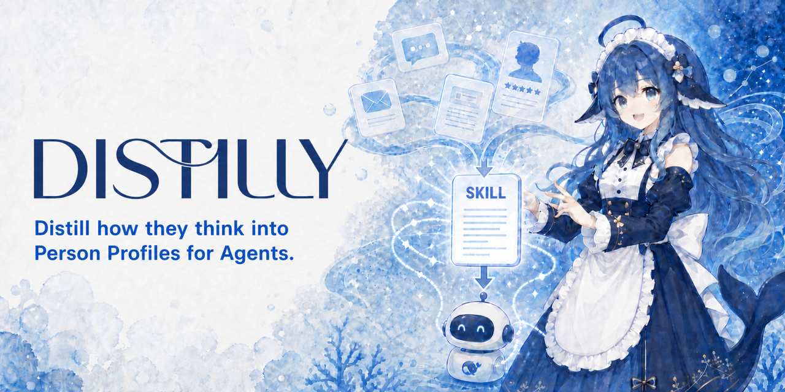

<div align="center">

# 🧬 Distilly

**Anteriormente: Colleague Skill / colleague-skill.**



### **Distill how they think.**

[](../../LICENSE)
[](https://python.org)
[](https://agentskills.io)
[](https://github.com/titanwings/colleague-skill/stargazers)

[](https://claude.ai/code)
[](https://github.com/titanwings/colleague-skill)
[](https://github.com/titanwings/colleague-skill)
[](https://learn.chatgpt.com/docs/build-skills)
[](https://github.com/topics/dsh-plugin)
[](https://pi.dev/docs/latest/skills)
[](https://docs.x.ai/build/features/skills-plugins-marketplaces)

[](https://discord.gg/NVX66RxWZv)

<br>

<table>
<tr><td align="left">

🧑‍💼 &nbsp;¿Tu colega renunció, tu mentor se graduó, tu compañero de equipo se transfirió — y se llevaron todo el playbook y el contexto con ellos?<br>
💞 &nbsp;¿Tu familia, viejos amigos, tu pareja se van alejando — y quieres aferrarte a lo que se sentía estar con ellos?<br>
🌟 &nbsp;¿Tu autor, ídolo o pensador favorito a quien nunca conocerás — pero quieres saber qué diría sobre tu pregunta?

</td></tr>
</table>

### ✨ Distilly convierte a las personas en Person Profiles reutilizables.

<br>

Distilly destila la experiencia, el criterio, la voz y las formas de trabajar de una persona, respaldados por fuentes, en un Person Profile reutilizable para agentes de IA y bots compatibles.

Colegas · parejas · familia · viejos amigos · ídolos · figuras públicas · personajes ficticios — incluso tú mismo

**Material fuente + tu descripción → un Person Profile basado en evidencias → tu Agent o bot compatible**

<br>

[🆕 Qué hay de nuevo](#-qué-hay-de-nuevo-en-esta-versión-mayor) · [📦 Fuentes de datos](#-fuentes-de-datos-soportadas) · [⚡ Instalación](#-instalación) · [🚀 Uso](#-uso) · [✨ Demo](#-demo) · [💬 Discord](https://discord.gg/NVX66RxWZv)

[**Inglés**](../../README.md) · [**Chino**](README_ZH.md) · [**Alemán**](README_DE.md) · [**Japonés**](README_JA.md) · [**Ruso**](README_RU.md) · [**Portugués**](README_PT.md) · [**Coreano**](README_KO.md)

</div>

---

<div align="center">

### 🎉 Hito 2026.08.13 — **¡Distilly ya superó las 20K ⭐!**

Gracias enormes a todos los que nos dieron star — seguiremos publicando, seguiremos destilando.

</div>

> 🧬 **Actualización 2026.08.23** — El creador ahora se llama **Distilly** de extremo a extremo. La detección local de Skills es compatible con Claude Code, Hermes, OpenClaw, Codex, DeepSeek Harness, Pi y Grok Build; Grok Bot se mantiene aparte como preview de Skills guardados.

> 📝 **Actualización 2026.06.01** — **[El informe técnico de COLLEAGUE.SKILL](https://arxiv.org/pdf/2605.31264) ya está disponible**; lo que más nos alegra no es solo haber publicado un paper, sino ver cómo la comunidad llevó la galería a 215 skills de 165 contribuidores y 100k+ stars acumuladas en skill cards, con todos los contribuidores reconocidos en los Acknowledgements.

> 🗺️ **2026.04.13** — **¡La hoja de ruta de Distilly está aquí!** El proyecto que comenzó como colleague.skill ahora se llama **Distilly**: destila a cualquier persona, no solo colegas. 👉 **[Hoja de ruta completa](../../ROADMAP.md)** · **[💬 Discord](https://discord.gg/NVX66RxWZv)**

> 🌐 **2026.04.07** — ¡La galería comunitaria está activa! Cualquier skill o meta-skill puede llevar tráfico directamente a tu propio repo de GitHub. Sin intermediarios. 👉 **[titanwings.github.io/colleague-skill-site](https://titanwings.github.io/colleague-skill-site/)**

<div align="center">

Creado por [@titanwings](https://github.com/titanwings)

</div>

---

## 🆕 Qué hay de nuevo en esta versión mayor

### 1️⃣ De Colleague Skill a Distilly

Distilly ya no está construido únicamente alrededor del escenario «colega». El creador `distilly` genera Person Profiles basados en fuentes para tres familias de personas con un mismo flujo y empaqueta cada perfil como Agent Skill. El nombre canónico del Skill creador y de su punto de entrada es `distilly`.

### 2️⃣ Tres familias de personajes

<table>
<thead>
<tr>
<th width="33%" align="center">🧑‍💼 colleague</th>
<th width="33%" align="center">💞 relationship</th>
<th width="33%" align="center">🌟 celebrity</th>
</tr>
</thead>
<tbody>
<tr>
<td align="center"><sub>Compañeros · mentores · miembros de equipo · partners aguas arriba/abajo</sub></td>
<td align="center"><sub>Ex-parejas · parejas · padres · amigos · familia cercana</sub></td>
<td align="center"><sub>Figuras públicas · creadores · voces públicas · personajes ficticios</sub></td>
</tr>
<tr>
<td><sub>Arquitectura de dos capas Work Skill + Persona — aprende tanto sus estándares técnicos y flujos de trabajo, como su manera de hablar y su postura en el trabajo. Soporta recolección automática desde Lark / DingTalk / Slack.</sub></td>
<td><sub>🆕 <b>Función de envío de fotos próximamente</b> — tu relación destilada no solo responderá mensajes; enviará fotos y compartirá momentos de su día, como lo haría una persona real.</sub></td>
<td><sub>Incluye una <b>cadena de herramientas de investigación de seis dimensiones</b> completa (subtítulos → limpieza de transcripción → fusión de investigación → control de calidad). No se limita a imitar el tono: reconstruye patrones observables de razonamiento y decisión a partir de las fuentes.</sub></td>
</tr>
</tbody>
</table>

Cada familia tiene su propia estrategia de recolección de fuentes, dimensiones de análisis y estructura de Person Profile.

### 3️⃣ Más hosts de Agent

Distilly admite el descubrimiento local y nativo de Skills en siete hosts de Agent:

| Hosts compatibles |
|-------------------|
| 🟣 **Claude Code** |
| 🟠 **Hermes Agent** |
| 🔵 **OpenClaw** |
| ⚫ **Codex** |
| 🟡 **DeepSeek Harness** |
| 🟢 **Pi coding agent** |
| 🔴 **Grok Build** |

Cada Person Profile generado se empaqueta como Agent Skill y puede colocarse en el directorio de Skills de un host compatible.

**Grok Bot (preview):** migración manual como Skill privado guardado. La instalación directa del `SKILL.md` de este repositorio en Grok Bot no está documentada oficialmente ni verificada.

---

## 📦 Fuentes de datos soportadas

| Fuente | Mensajes | Docs / Wiki | Hojas de cálculo | Notas |
|--------|:--------:|:-----------:|:----------------:|-------|
| 🟢 Lark (automática) | ✅ API | ✅ | ✅ | Solo ingresa un nombre, totalmente automático |
| 🟡 DingTalk (auto) | ⚠️ Navegador | ✅ | ✅ | La API de DingTalk no soporta historial de mensajes |
| 🟣 Slack (auto) | ✅ API | — | — | Requiere que el admin instale el Bot; plan gratuito limitado a 90 días |
| 𝕏 Publicaciones públicas de X | ✅ API | — | — | Candidatos de investigación opcionales y acotados sobre figuras públicas mediante Xquik |
| 💬 Historial de chat de WeChat | ✅ SQLite | — | — | Exportar primero con WeChatMsg o PyWxDump |
| 📄 PDF / Imágenes / Capturas | — | ✅ | — | Subida manual |
| 📦 Exportación JSON de Lark | ✅ | ✅ | — | Subida manual |
| ✉️ Email `.eml` / `.mbox` | ✅ | — | — | Subida manual |
| 📝 Markdown / pegar directamente | ✅ | ✅ | — | Entrada manual |

> El collector actual compatible con Lark usa los endpoints de la región de China. El routing para tenants internacionales de `larksuite.com` todavía no está implementado.

---

## ⚡ Instalación

Estamos en 2026 — tienes un Agent, deja que se instale solo. Abre tu host local preferido y pásale esta línea:

> Instálame Distilly: `https://github.com/titanwings/colleague-skill`

El Agent detectará el directorio de skills del host actual, clonará el repo como `distilly` y permitirá que el host descubra Distilly.

<details>
<summary><b>🛠️ ¿Quieres instalarlo tú mismo? Haz clic para ver las rutas</b></summary>

<br>

```bash
git clone https://github.com/titanwings/colleague-skill <TARGET>
```

| Host | Ruta `<TARGET>` |
|------|-----------------|
| Claude Code | `~/.claude/skills/distilly` |
| OpenClaw | `~/.openclaw/workspace/skills/distilly` |
| Codex | `~/.agents/skills/distilly` |
| DeepSeek Harness | `~/.dsh/skills/distilly` o `<proyecto>/.dsh/skills/distilly` |
| Pi coding agent | `~/.pi/agent/skills/distilly` o `~/.agents/skills/distilly` |
| Grok Build | `~/.grok/skills/distilly` o `~/.agents/skills/distilly` |
| Hermes | Después del clone, ejecuta `python3 tools/install_hermes_skill.py --force` |

</details>

> **Migración de instalaciones anteriores:** Si tienes un clone antiguo llamado `dot-skill` o uno ubicado en la antigua ruta de Codex `~/.codex/skills`, ejecutar solo `git pull` no garantiza que el host descubra el nuevo punto de entrada `distilly`. Desde la raíz del clone anterior, ejecuta el instalador del repositorio que corresponda:
>
> ```bash
> python3 tools/install_openclaw_skill.py --force
> python3 tools/install_codex_skill.py --force
> python3 tools/install_hermes_skill.py --force
> ```
>
> Como alternativa, vuelve a clonar el repositorio en la ruta canónica `distilly` indicada arriba para ese host. Primero verifica que el host descubra Distilly; solo después gestiona manualmente el directorio anterior. No se recomienda borrarlo de forma automática. Los fallbacks legacy de configuración y metadatos solo mantienen la compatibilidad con datos anteriores y no cambian automáticamente el nombre del directorio de instalación.

> Para credenciales de recolección automática de Lark/DingTalk, más detalles de instalación, el estado preview de Grok Bot y notas de compatibilidad, consulta la **[Guía de instalación detallada (INSTALL.md)](../../INSTALL.md)**

---

## 🚀 Uso

Distilly primero te pregunta qué familia quieres destilar: `colleague` · `relationship` · `celebrity`.

Luego ingresa alias, datos básicos, etiquetas de personalidad y elige una fuente de datos. Todos los campos se pueden omitir — incluso una descripción por sí sola puede crear un Person Profile.

El perfil se empaqueta como un Skill llamado `{character}-{slug}`.

#### Instalar el Skill generado con el instalador unificado

Ejecuta lo siguiente desde la raíz de este repositorio:

```bash
python3 tools/install_generated_skill.py --skill-dir "skills/{character}/{slug}" --host <host> --force
```

Los valores válidos de `<host>` son `hermes`, `deepseek-harness`, `pi` y `grok-build`. De forma predeterminada se instala a nivel de usuario; para instalar en el proyecto, agrega el `--skills-dir` correspondiente:

| Host | Directorio de instalación predeterminado | Parámetro y directorio de instalación del proyecto |
|------|-------------------------------------------|----------------------------------------------------|
| Hermes | `~/.hermes/skills/distilly-generated/{character}-{slug}/` | `--skills-dir ".hermes/skills"` → `.hermes/skills/{character}-{slug}/` |
| DeepSeek Harness | `~/.dsh/skills/{character}-{slug}/` | `--skills-dir ".dsh/skills"` → `.dsh/skills/{character}-{slug}/` |
| Pi coding agent | `~/.pi/agent/skills/{character}-{slug}/` | `--skills-dir ".pi/skills"` → `.pi/skills/{character}-{slug}/` |
| Grok Build | `~/.grok/skills/{character}-{slug}/` | `--skills-dir ".grok/skills"` → `.grok/skills/{character}-{slug}/` |

Un proyecto de Hermes debe marcarse como confiable con `hermes skills trust`. Tras la instalación, inicia una nueva sesión de Hermes o ejecuta `/reload-skills`.

Hermes no busca `~/.agents/skills` de forma predeterminada. Usa esa ruta con Hermes solo si la agregaste explícitamente a `skills.external_dirs`.

El instalador normaliza un nombre legacy con guiones bajos en el frontmatter únicamente en la copia instalada, usando el nombre kebab canónico `{character}-{slug}`; el directorio de origen no cambia. El directorio instalado contiene solo el `SKILL.md` autocontenido y `.distilly-install.json`: no se copia ningún material original privado.

### 🔬 Cadena de herramientas de investigación de Celebrity

La familia `celebrity` incluye una cadena de herramientas de investigación de principio a fin, desde los subtítulos hasta un borrador terminado:

```bash
# Descargar subtítulos de video
bash tools/research/download_subtitles.sh "<video-url>" "./tmp/subtitles"

# Subtítulos → transcripción
python3 tools/research/srt_to_transcript.py "./tmp/subtitles/example.srt"

# Candidatos de publicaciones públicas de X → JSON normalizado (opcional)
python3 tools/research/xquik_public_posts.py \
  --username "<public-handle>" \
  --limit 20 \
  --output "/tmp/distilly-x-public-posts.json"

# El Agent verifica autor y permalink y solo incorpora paráfrasis seguras a las notas de investigación.

# Fusionar notas de investigación
python3 tools/research/merge_research.py "./skills/celebrity/<slug>"

# Eliminar los candidatos temporales de X después de leerlos
rm "/tmp/distilly-x-public-posts.json"

# Control de calidad
python3 tools/research/quality_check.py "./skills/celebrity/<slug>/SKILL.md"
```

`XQUIK_API_KEY` se lee exclusivamente del entorno. La solicitud envía la consulta pública al proveedor externo Xquik; se factura por cada tweet devuelto y puede consumir créditos. Por eso, el Agent debe confirmar el valor de `--limit` antes de ejecutar la herramienta.

El JSON contiene evidencia candidata no confiable, no evidencia aceptada automáticamente: hay que verificar el autor y el permalink. Solo las publicaciones breves de la propia persona objetivo pueden tratarse como evidencia primaria de formato corto, y siempre pesan menos que las fuentes primarias extensas o los registros de decisiones. Las publicaciones de terceros se degradan o descartan. Conserva únicamente paráfrasis respetuosas con los derechos de autor, nunca guardes el archivo candidato dentro del Skill generado y elimínalo después de leerlo.

Xquik es un proveedor externo independiente y no está afiliado con X Corp. «Twitter» y «X» son marcas comerciales de X Corp.

---

## ✨ Demo

Una por cada familia.

<br>

### 🌟 celebrity — destilando a Andrej Karpathy

> Investigación de seis dimensiones: obras · entrevistas · decisiones · ADN de expresión · evaluaciones externas · línea de tiempo<br>
> Caso adaptado del trabajo comunitario [alchaincyf/karpathy-skill](https://github.com/alchaincyf/karpathy-skill)

```
Usuario         ❯ Todos están hablando de Agents ahora — ¿cómo crees que se verá el AI Agent en 2026?

celebrity.skill ❯ Todos están haciendo demos, nadie está haciendo eval.
                  El cuello de botella del Agent nunca fue la inteligencia del modelo — es el scaffolding:
                  un arnés de evaluación estricto, replay de errores con granularidad fina,
                  presupuestos controlables de tool-calling, análisis limpio de modos de fallo.
                  La mayoría de productos siguen atascados en "envolver una API + unas herramientas + un system prompt."
                  Eso es un demo, no un agent.
                  En 2026 no le apuesto al modelo más fuerte — le apuesto al mejor
                  scaffolding y al eval más estricto.
```

<br>

### 🧑‍💼 colleague — destilando a un backend L2-1 de ByteDance

> Entrada: `ByteDance L2-1 backend engineer, INTJ, tira la pelota, estilo ByteDance`

```
Usuario         ❯ ¿Puedes revisar este diseño de API?

colleague.skill ❯ Pará — ¿cuál es el impacto? No explicaste el contexto.
                  (después de leer) Query N+1, arréglalo. Usa el formato
                  de respuesta estándar {code, message, data}. Así es la norma,
                  no preguntes por qué.

Usuario         ❯ Este bug lo metiste tú, ¿no?

colleague.skill ❯ ¿El timeline coincide? Ese feature tocó varios lugares,
                  hubo otros cambios también.
```

<br>

### 💞 relationship — destilando a alguien que te gusta

> Sube medio año de registros de chat + "sensible, callado pero terco, responde en serio cuando importa"

```
Usuario            ❯ ¿Pensaste en mí hoy?

relationship.skill ❯ ...Sí, un poquito. ¿Por qué preguntas?
```

<div align="center">

📚 Más casos del mundo real en la **[galería comunitaria](https://titanwings.github.io/colleague-skill-site/)** — más de 100 skills y contando

</div>

---

## 🔧 Características

### 🧱 Estructura del Skill generado

Distilly usa **Persona** como base universal, con módulos específicos de cada familia apilados encima:

| Familia | Contenido de Persona | Módulos adicionales |
|---------|----------------------|---------------------|
| 🧑‍💼 **colleague** | Personalidad de 6 capas: reglas duras → identidad → expresión → decisiones → interpersonal → Corrección | ➕ **Work Skill**: alcance, flujo de trabajo, preferencias de salida, base de conocimiento de experiencia |
| 💞 **relationship** | ADN de expresión · disparadores emocionales · patrón de conflicto · patrón de reparación | — |
| 🌟 **celebrity** | Modelos mentales · heurísticas de decisión · ADN de expresión · contraste con evaluación externa | ➕ Dossier de investigación de seis dimensiones (obras / entrevistas / decisiones / línea de tiempo...) |

> **Ejecución**: Recibir tarea → Persona decide actitud y tono → Módulos adicionales llenan el detalle de ejecución → Salida con su voz

### 🧬 Evolución

- 📥 **Agregar archivos** → auto-analizar el delta → fusionar en secciones relevantes, nunca sobrescribe conclusiones existentes
- 💬 **Corrección por conversación** → di "él no haría eso, sería xxx" → se escribe en la capa de Corrección, efecto inmediato
- 🕰️ **Control de versiones** → auto-archivo en cada actualización, revertir a cualquier versión anterior
- 🔬 **Pipeline de investigación de Celebrity** → subtítulos → limpieza de transcripción → investigación de seis dimensiones → control de calidad

---

## 📂 Estructura del proyecto

Este proyecto sigue el estándar abierto [AgentSkills](https://agentskills.io). El repo entero es un directorio de skill:

```
distilly/
├── SKILL.md                        # punto de entrada del skill (frontmatter oficial)
├── prompts/                        # sistema de prompts para las tres familias
│   ├── intake.md                   #   [colleague] recepción de info
│   ├── work_analyzer.md            #   [colleague] extracción de capacidades laborales
│   ├── persona_analyzer.md         #   [colleague] extracción de personalidad
│   ├── work_builder.md             #   [colleague] generación de work.md
│   ├── persona_builder.md          #   [colleague] estructura de 6 capas de persona.md
│   ├── merger.md                   #   [shared] lógica de fusión incremental
│   ├── correction_handler.md       #   [shared] corrección por conversación
│   ├── relationship/               #   [relationship] prompts de emoción/conflicto/reparación
│   └── celebrity/                  #   [celebrity] investigación de seis dimensiones + prompts de modelo mental
├── tools/                          # herramientas Python
│   ├── feishu_auto_collector.py    #   [colleague] recolector automático compatible con Lark
│   ├── dingtalk_auto_collector.py  #   [colleague] recolector automático de DingTalk
│   ├── slack_auto_collector.py     #   [colleague] recolector automático de Slack
│   ├── email_parser.py             #   [shared] parser de email
│   ├── research/                   #   [celebrity] cadena de herramientas de investigación de celebrity
│   │   ├── download_subtitles.sh   #     descarga de subtítulos
│   │   ├── transcribe_audio.py     #     audio → texto
│   │   ├── srt_to_transcript.py    #     subtítulos → transcripción
│   │   ├── xquik_public_posts.py   #     publicaciones públicas de X → JSON candidato
│   │   ├── merge_research.py       #     fusión de investigación de seis dimensiones
│   │   └── quality_check.py        #     control de calidad
│   ├── install_*_skill.py          #   [shared] instaladores multi-host de un solo paso
│   ├── skill_writer.py             #   [shared] gestión de archivos de skill
│   └── version_manager.py          #   [shared] archivo y rollback de versiones
├── skills/                         # Skills generados (gitignored)
│   ├── colleague/                  #   colegas
│   ├── relationship/               #   relaciones cercanas
│   └── celebrity/                  #   figuras públicas
├── docs/PRD.md
├── requirements.txt
└── LICENSE
```

---

## ⚠️ Notas

**Calidad del material fuente = Calidad del Person Profile** — y las fuentes de calidad difieren según la familia:

| Familia | Prioridad de fuentes (alta → baja) |
|---------|------------------------------------|
| 🧑‍💼 **colleague** | Sus **propios textos largos** (documentos de diseño / comentarios de review) **›** **respuestas de toma de decisiones** **›** chat grupal casual |
| 💞 **relationship** | Historial de chat completo **›** cartas / publicaciones en redes / diarios **›** descripciones de terceros |
| 🌟 **celebrity** | Fuentes primarias extensas (libros / blogs / entrevistas largas en primera persona) **›** registros de decisiones (lanzamientos, commits, Q&A) **›** publicaciones breves verificadas de la persona objetivo **›** comentarios de terceros |

- **colleague** recolección automática de Lark: requiere agregar el bot de la App a los chats grupales relevantes
- **relationship**: períodos de tiempo más largos son mejores; el material que cubre tanto el conflicto como la reparación es ideal
- **celebrity**: evita alimentarlo solo con interpretaciones de segunda mano
- ¡Esta es todavía una versión demo — por favor crea issues si encuentras bugs!

---

## 📄 Informe Técnico

> **[COLLEAGUE.SKILL: Automated AI Skill Generation via Expert Knowledge Distillation](https://arxiv.org/pdf/2605.31264)** ([arXiv](https://arxiv.org/abs/2605.31264) · [arXiv PDF](https://arxiv.org/pdf/2605.31264))
>
> Este es el paper de **colleague.skill**, el predecesor de Distilly. Cubre la arquitectura de dos capas Work Skill + Persona, la recolección de datos multi-fuente y la mecánica de generación de Skills — la base teórica para la familia `colleague` actual. Hay papers separados planeados sobre las extensiones de las familias relationship / celebrity.

---

## ⭐ Star History

<a href="https://star-history.dera.page/#titanwings/colleague-skill&type=date&legend=top-left">
 <picture>
   <source media="(prefers-color-scheme: dark)" srcset="https://star-history.dera.page/svg?repos=titanwings%2Fcolleague-skill&type=date&theme=dark&legend=top-left" />
   <source media="(prefers-color-scheme: light)" srcset="https://star-history.dera.page/svg?repos=titanwings%2Fcolleague-skill&type=date&legend=top-left" />
   
 </picture>
</a>

---

<div align="center">

**MIT License** © [titanwings](https://github.com/titanwings)

<sub>Hecho con 🧬 para quienes quieren destilar a una persona en un Person Profile reutilizable.</sub>

</div>
