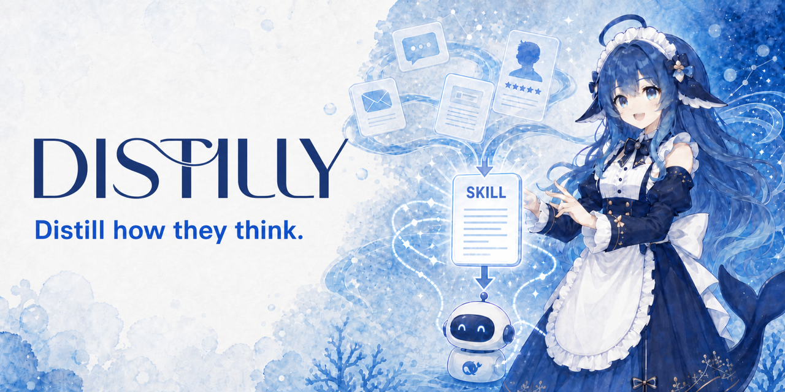

<div align="center">

# 🧬 Distilly

**Formerly: Colleague Skill / colleague-skill（原同事 Skill）**



### **Distill how they think.**

[](../../LICENSE)
[](https://python.org)
[](https://agentskills.io)
[](https://github.com/titanwings/colleague-skill/stargazers)

[](https://claude.ai/code)
[](https://github.com/titanwings/colleague-skill)
[](https://github.com/titanwings/colleague-skill)
[](https://learn.chatgpt.com/docs/build-skills)
[](https://github.com/topics/dsh-plugin)
[](https://pi.dev/docs/latest/skills)
[](https://docs.x.ai/build/features/skills-plugins-marketplaces)

[](https://discord.gg/NVX66RxWZv)

<br>

<table>
<tr><td align="left">

🧑‍💼 &nbsp;Коллега уволился, наставник выпустился, напарник перевёлся — и унёс с собой весь плейбук и контекст?<br>
💞 &nbsp;Родные, старые друзья, партнёр отдаляются — а ты хочешь сохранить то самое ощущение от общения с ними?<br>
🌟 &nbsp;Любимый автор, кумир, мыслитель, с которым ты никогда не встретишься — но хочется знать, что бы он сказал на твой вопрос?

</td></tr>
</table>

### ✨ Distilly превращает людей в переиспользуемые Skills.

<br>

Distilly превращает подтверждённые источниками опыт, логику решений, голос и рабочие процессы человека в переиспользуемый Skill для ИИ-агентов и совместимых ботов.

Коллеги · партнёры · родные · старые друзья · кумиры · публичные фигуры · вымышленные персонажи — даже ты сам

**Исходные материалы + твоё описание → Skill, основанный на источниках и наблюдаемых паттернах**

<br>

[🆕 Что нового](#-что-нового-в-этом-крупном-релизе) · [📦 Источники данных](#-поддерживаемые-источники-данных) · [⚡ Установка](#-установка) · [🚀 Использование](#-использование) · [✨ Демо](#-демо) · [💬 Discord](https://discord.gg/NVX66RxWZv)

[**English**](../../README.md) · [**中文**](README_ZH.md) · [**Español**](README_ES.md) · [**Deutsch**](README_DE.md) · [**日本語**](README_JA.md) · [**Português**](README_PT.md) · [**한국어**](README_KO.md)

</div>

---

<div align="center">

### 🎉 Веха 2026.08.13 — **Distilly превысил 20K ⭐!**

Огромное спасибо всем, кто поставил звезду — продолжим выпускать релизы, продолжим дистиллировать.

</div>

> 🧬 **Обновление 2026.08.23** — Имя creator'а, директория и точка входа теперь везде называются **Distilly**. Локальное обнаружение Skills для Claude Code, Hermes, OpenClaw, Codex, DeepSeek Harness, Pi и Grok Build описано по текущим правилам каждого хоста; Grok Bot отмечен отдельно как preview-сценарий с saved Skills.

> 📝 **Обновление 2026.06.01** — **[Технический отчёт COLLEAGUE.SKILL](https://arxiv.org/pdf/2605.31264) опубликован**; больше всего нас радует не просто выход paper, а то, что сообщество вместе вырастило gallery до 215 skills от 165 контрибьюторов и 100k+ суммарных stars на skill cards, а все участники сообщества были отдельно упомянуты в Acknowledgements.

> 🗺️ **2026.04.13** — **Дорожная карта Distilly опубликована!** Проект, начавшийся как colleague.skill, теперь называется **Distilly** и дистиллирует кого угодно, не только коллег. 👉 **[Полная дорожная карта](../../ROADMAP.md)** · **[💬 Discord](https://discord.gg/NVX66RxWZv)**

> 🌐 **2026.04.07** — Галерея сообщества запущена! Любой skill или meta-skill может направлять трафик прямо в твой GitHub-репозиторий. Без посредников. 👉 **[titanwings.github.io/colleague-skill-site](https://titanwings.github.io/colleague-skill-site/)**

<div align="center">

Создано [@titanwings](https://github.com/titanwings)

</div>

---

## 🆕 Что нового в этом крупном релизе?

### 1️⃣ От Colleague Skill к Distilly

Distilly больше не ограничен сценарием «коллега». Универсальный движок Skills дистиллирует любого человека по источникам, вместо того чтобы оставаться скриптом для коллег. Каноническое имя Skill'а и директории создателя теперь — `distilly`.

### 2️⃣ Три семейства персонажей

<table>
<thead>
<tr>
<th width="33%" align="center">🧑‍💼 colleague</th>
<th width="33%" align="center">💞 relationship</th>
<th width="33%" align="center">🌟 celebrity</th>
</tr>
</thead>
<tbody>
<tr>
<td align="center"><sub>Коллеги · наставники · тиммейты · смежники сверху и снизу</sub></td>
<td align="center"><sub>Бывшие · партнёры · родители · друзья · близкие</sub></td>
<td align="center"><sub>Публичные фигуры · создатели · публичные голоса · вымышленные персонажи</sub></td>
</tr>
<tr>
<td><sub>Двухслойная архитектура Work Skill + Persona — учит и их технические стандарты и воркфлоу, и манеру говорить, и рабочую позицию. Поддерживает автосбор из Lark / DingTalk / Slack.</sub></td>
<td><sub>🆕 <b>Функция отправки фото скоро появится</b> — твои дистиллированные отношения не будут просто отвечать на сообщения; они будут присылать фотографии и делиться кусочками своего дня, как это делал бы живой человек.</sub></td>
<td><sub>Поставляется с полным <b>тулчейном шестимерного исследования</b> (субтитры → очистка транскрипта → мерж исследований → проверка качества). Не просто имитирует тон, а восстанавливает по источникам наблюдаемые паттерны рассуждений и решений.</sub></td>
</tr>
</tbody>
</table>

У каждого семейства — собственный пайплайн промптов, стратегия сбора источников и шаблон генерации.

### 3️⃣ Больше Agent-хостов

Старая версия работала только в Claude Code. Теперь семь локальных хостов нативно обнаруживают Distilly в формате `SKILL.md`. Синтаксис явного вызова зависит от хоста:

| Хост | Как вызвать Distilly |
|------|----------------------|
| 🟣 **Claude Code** | `/distilly` |
| 🟠 **Hermes Agent** | `/distilly` |
| 🔵 **OpenClaw** | `/distilly`; при необходимости `/skill distilly` |
| ⚫ **Codex** | `$distilly` или выбор через `/skills` |
| 🔷 **DeepSeek Harness** | `/distilly` |
| 🟡 **Pi coding agent** | `/skill:distilly` |
| ⚪ **Grok Build** | `/distilly` |

Сгенерированные Skill'ы персонажей используют тот же формат Agent Skills и устанавливаются в директорию Skills соответствующего хоста.

**Preview для Grok Bot:** вручную перенеси workflow Distilly в private saved skill, включи его для нужного Bot в Settings → Plugins и выбери, набрав `/` в поле ввода. Прямая установка `SKILL.md` из этого репозитория в Grok Bot не описана в официальной документации и не проверена.

---

## 📦 Поддерживаемые источники данных

| Источник | Сообщения | Документы / Wiki | Таблицы | Примечания |
|----------|:---------:|:----------------:|:-------:|------------|
| 🟢 Lark (авто) | ✅ API | ✅ | ✅ | Просто введи имя — полная автоматизация |
| 🟡 DingTalk (авто) | ⚠️ Браузер | ✅ | ✅ | API DingTalk не даёт доступ к истории сообщений |
| 🟣 Slack (авто) | ✅ API | — | — | Нужна установка бота админом; бесплатный план — 90 дней |
| 𝕏 Публичные посты X | ✅ API | — | — | Необязательные ограниченные кандидаты для celebrity-исследования через Xquik |
| 💬 История чатов WeChat | ✅ SQLite | — | — | Сначала экспортируй через WeChatMsg / PyWxDump / 留痕 |
| 📄 PDF / Изображения / Скриншоты | — | ✅ | — | Ручная загрузка |
| 📦 JSON-экспорт Lark | ✅ | ✅ | — | Ручная загрузка |
| ✉️ Email `.eml` / `.mbox` | ✅ | — | — | Ручная загрузка |
| 📝 Markdown / прямая вставка | ✅ | ✅ | — | Ручной ввод |

> **Примечание о совместимости с Lark:** текущий совместимый сборщик использует API-эндпоинты китайского региона. Маршрутизация через международные эндпоинты `larksuite.com` ещё не реализована.

---

## ⚡ Установка

На дворе 2026-й — у тебя есть Agent, пусть он и установит сам себя. Открой свой Claude Code / Hermes / OpenClaw / Codex / DeepSeek Harness / Pi coding agent / Grok Build и дай ему эту строку:

> Установи мне Distilly: `https://github.com/titanwings/colleague-skill`

Агент сам определит директорию skill'ов текущего хоста, склонирует репозиторий и зарегистрирует точку входа `distilly`. После этого используй синтаксис своего хоста из таблицы ниже.

<details>
<summary><b>🛠️ Хочешь установить вручную? Жми — тут пути</b></summary>

<br>

```bash
git clone https://github.com/titanwings/colleague-skill <TARGET>
```

| Хост | Путь `<TARGET>` |
|------|-----------------|
| Claude Code | `~/.claude/skills/distilly` |
| Hermes | После клонирования выполни `python3 tools/install_hermes_skill.py --force` |
| OpenClaw | `~/.openclaw/workspace/skills/distilly` |
| Codex | `~/.agents/skills/distilly` |
| DeepSeek Harness | `~/.dsh/skills/distilly` или `.dsh/skills/distilly` в проекте |
| Pi coding agent | `~/.pi/agent/skills/distilly` или `~/.agents/skills/distilly` |
| Grok Build | `~/.grok/skills/distilly` или `~/.agents/skills/distilly` |

</details>

> **Миграция существующей установки:** clone с прежним именем `dot-skill` или clone в устаревшем корне `~/.codex/skills` не гарантирует обнаружение новой точки входа `distilly` после одного лишь `git pull`. Из корня старого clone запусти подходящий установщик репозитория (`tools/install_openclaw_skill.py`, `tools/install_codex_skill.py` или `tools/install_hermes_skill.py`) либо заново клонируй репозиторий в показанный выше канонический путь `distilly` для своего хоста. Сначала проверь новый вызов для хоста, а затем вручную реши, что делать со старым каталогом; не удаляй его автоматически. Legacy fallback для config/meta сохраняет чтение старых данных, но не переименовывает установленный каталог.

Устанавливай сгенерированный Skill персонажа из корня репозитория с помощью единого установщика:

```bash
python3 tools/install_generated_skill.py --skill-dir "skills/{character}/{slug}" --host <host> --force
```

Допустимые значения `<host>`: `hermes`, `deepseek-harness`, `pi` и `grok-build`. По умолчанию выполняется пользовательская установка; для установки в проект добавь соответствующий параметр `--skills-dir`:

| Хост | Каталог установки по умолчанию | Параметр и каталог установки в проекте |
|------|--------------------------------|----------------------------------------|
| Hermes | `~/.hermes/skills/distilly-generated/{character}-{slug}/` | `--skills-dir ".hermes/skills"` → `.hermes/skills/{character}-{slug}/` |
| DeepSeek Harness | `~/.dsh/skills/{character}-{slug}/` | `--skills-dir ".dsh/skills"` → `.dsh/skills/{character}-{slug}/` |
| Pi coding agent | `~/.pi/agent/skills/{character}-{slug}/` | `--skills-dir ".pi/skills"` → `.pi/skills/{character}-{slug}/` |
| Grok Build | `~/.grok/skills/{character}-{slug}/` | `--skills-dir ".grok/skills"` → `.grok/skills/{character}-{slug}/` |

Установщик нормализует устаревший frontmatter с подчёркиваниями до канонического kebab-имени `{character}-{slug}` только в установленной копии и не изменяет исходный каталог. В установленном каталоге находятся только самодостаточный `SKILL.md` и `.distilly-install.json`; приватные исходные материалы из сгенерированного каталога не копируются.

Для проектной установки Hermes сначала отметь проект как доверенный командой `hermes skills trust`. После установки начни новую сессию Hermes или выполни `/reload-skills`. `~/.agents/skills` не является стандартной директорией Hermes; она используется только после явного добавления в `skills.external_dirs`.

> Про учётные данные для автосбора Lark/DingTalk, команды конкретных хостов, preview-сценарий Grok Bot, специфику Windows и прочее — см. **[Подробное руководство по установке (INSTALL.md)](../../INSTALL.md)**

---

## 🚀 Использование

В хосте, где установлен Distilly, используй синтаксис из таблицы ниже или просто скажи агенту «запусти Distilly».

Сначала он спросит, какое семейство ты хочешь дистиллировать: `colleague` · `relationship` · `celebrity`.

Дальше введи псевдоним, базовый профиль, теги личности и выбери источник данных. Все поля можно пропустить — даже одного описания достаточно, чтобы сгенерировать Skill.

После создания вызывай Skill с именем `{character}-{slug}` по правилам своего хоста.

### 🎛️ Команды

| Хост / элемент | Вызов / описание |
|----------------|-----------------|
| Claude Code | `/distilly` |
| Hermes Agent | `/distilly` |
| OpenClaw | `/distilly`; запасной вариант: `/skill distilly` |
| Codex | `$distilly` или `/skills` |
| DeepSeek Harness | `/distilly` |
| Pi coding agent | `/skill:distilly` |
| Grok Build | `/distilly` |
| `{character}-{slug}` | Имя полного сгенерированного Skill'а (Persona + Work); вызывай по синтаксису хоста выше |
| `python3 tools/skill_writer.py --action list ...` | Список сгенерированных Skill'ов всех трёх семейств |
| `python3 tools/version_manager.py --action rollback ...` | Откатить версию Skill'а |

### 🔬 Celebrity Research Toolchain

Семейство `celebrity` поставляется со сквозным исследовательским тулчейном — от субтитров до готового драфта:

Сбор публичных постов X необязателен. API-ключ читается только из переменной окружения `XQUIK_API_KEY`. Публичный запрос отправляется стороннему сервису Xquik; Xquik тарифицирует каждый возвращённый твит, что может расходовать credits, поэтому агент должен подтвердить `limit` до вызова.

Выходной JSON считай недоверенным набором кандидатов в доказательства. Проверяй автора и permalink; как короткие первичные источники используй только посты самого исследуемого человека и ставь их ниже длинных первичных материалов и записей о принятых решениях. Посты третьих лиц понижай до вторичных материалов или отбрасывай. Сохраняй только безопасный с точки зрения авторского права пересказ, а после чтения удаляй временный файл за пределами директории Skill'а.

Xquik — независимый сторонний сервис, не связанный с X Corp. «Twitter» и «X» — торговые марки X Corp.

```bash
# Скачать субтитры видео
bash tools/research/download_subtitles.sh "<video-url>" "./tmp/subtitles"

# Субтитры → транскрипт
python3 tools/research/srt_to_transcript.py "./tmp/subtitles/example.srt"

# Кандидаты из публичных постов X → временный нормализованный JSON (необязательно)
python3 tools/research/xquik_public_posts.py \
  --username "<public-handle>" \
  --limit 20 \
  --output "/tmp/distilly-x-public-posts.json"

# Удалить, когда агент проверит и перескажет отобранные кандидаты
rm "/tmp/distilly-x-public-posts.json"

# Мерж исследовательских заметок
python3 tools/research/merge_research.py "./skills/celebrity/<slug>"

# Проверка качества
python3 tools/research/quality_check.py "./skills/celebrity/<slug>/SKILL.md"
```

---

## ✨ Демо

По одному примеру на семейство.

<br>

### 🌟 celebrity — дистиллируем Andrej Karpathy

> Шестимерное исследование: работы · интервью · решения · ДНК выражения · внешние оценки · таймлайн<br>
> Кейс адаптирован из работы сообщества [alchaincyf/karpathy-skill](https://github.com/alchaincyf/karpathy-skill)

```
User            ❯ Все сейчас говорят про агентов — как, по-твоему, выглядит AI Agent 2026 года?

celebrity.skill ❯ Все делают демки, никто не делает eval.
                  Узкое место агента — никогда не интеллект модели, а обвязка:
                  строгий eval-харнесс, тонкозернистый replay ошибок,
                  управляемые бюджеты вызова инструментов, чистый анализ режимов отказа.
                  Большинство продуктов до сих пор застряли на «обёртка вокруг API + пара тулов + системный промпт».
                  Это демо, а не агент.
                  В 2026-м я ставлю не на самую сильную модель —
                  я ставлю на лучшую обвязку и самый строгий eval.
```

<br>

### 🧑‍💼 colleague — дистиллируем бэкендера ByteDance L2-1

> Ввод: `ByteDance L2-1 бэкенд-инженер, INTJ, перекидыватель стрелок, ByteDance-стайл`

```
User            ❯ Посмотришь этот дизайн API?

distilly ❯ Подожди — какой impact? Ты контекст не объяснил.
                  (после прочтения) N+1 запрос, исправь. Используй стандартный
                  формат ответа {code, message, data}. Это спецификация,
                  не спрашивай почему.

User            ❯ Этот баг ведь ты завёл, да?

distilly ❯ Таймлайн совпадает? В этой фиче было несколько мест,
                  и другие изменения тоже были.
```

<br>

### 💞 relationship — дистиллируем человека, в которого ты влюблён

> Загружаем полгода переписки + «чувствительный, тихий, но упрямый, на важные вещи отвечает всерьёз»

```
User               ❯ Ты сегодня обо мне думал?

relationship.skill ❯ ...немного думал. А чего спрашиваешь?
```

<div align="center">

📚 Больше живых кейсов — в **[галерее сообщества](https://titanwings.github.io/colleague-skill-site/)** — 100+ навыков и считаем дальше

</div>

---

## 🔧 Возможности

### 🧱 Структура сгенерированного Skill'а

Distilly использует **Persona** как универсальную базу, поверх которой накладываются модули, специфичные для семейства:

| Семейство | Содержание Persona | Дополнительные модули |
|-----------|--------------------|----------------------|
| 🧑‍💼 **colleague** | 6-слойная личность: жёсткие правила → идентичность → выражение → решения → межличностное → коррекция | ➕ **Work Skill**: область, воркфлоу, предпочтения по выводу, база опыта |
| 💞 **relationship** | ДНК выражения · эмоциональные триггеры · паттерн конфликта · паттерн восстановления | — |
| 🌟 **celebrity** | Ментальные модели · эвристики принятия решений · ДНК выражения · контраст с внешними оценками | ➕ Шестимерное исследовательское досье (работы / интервью / решения / таймлайн...) |

> **Исполнение**: Получить задачу → Persona определяет отношение и тон → Дополнительные модули наполняют исполнение деталями → Вывод его голосом

### 🧬 Эволюция

- 📥 **Добавить файлы** → автоанализ дельты → мерж в соответствующие секции, никогда не перезаписывает существующие выводы
- 💬 **Коррекция через диалог** → скажи «он бы так не сделал, он должен быть xxx» → записывается в слой коррекции, мгновенный эффект
- 🕰️ **Версионирование** → автоархивация при каждом обновлении, откат к любой предыдущей версии
- 🔬 **Celebrity research pipeline** → субтитры → очистка транскрипта → шестимерное исследование → проверка качества

---

## 📂 Структура проекта

Этот проект следует открытому стандарту [AgentSkills](https://agentskills.io). Весь репозиторий — это директория skill'а:

```
distilly/
├── SKILL.md                        # точка входа skill'а (официальный frontmatter)
├── prompts/                        # система промптов для трёх семейств
│   ├── intake.md                   #   [colleague] сбор информации
│   ├── work_analyzer.md            #   [colleague] извлечение рабочих компетенций
│   ├── persona_analyzer.md         #   [colleague] извлечение личности
│   ├── work_builder.md             #   [colleague] генерация work.md
│   ├── persona_builder.md          #   [colleague] 6-слойная структура persona.md
│   ├── merger.md                   #   [shared] логика инкрементального мержа
│   ├── correction_handler.md       #   [shared] коррекция через диалог
│   ├── relationship/               #   [relationship] промпты эмоций/конфликтов/восстановления
│   └── celebrity/                  #   [celebrity] шестимерное исследование + промпты ментальных моделей
├── tools/                          # Python-инструменты
│   ├── feishu_auto_collector.py    #   [colleague] автосборщик Lark
│   ├── dingtalk_auto_collector.py  #   [colleague] автосборщик DingTalk
│   ├── slack_auto_collector.py     #   [colleague] автосборщик Slack
│   ├── email_parser.py             #   [shared] парсер писем
│   ├── research/                   #   [celebrity] исследовательский тулчейн
│   │   ├── download_subtitles.sh   #     скачивание субтитров
│   │   ├── transcribe_audio.py     #     аудио → текст
│   │   ├── srt_to_transcript.py    #     субтитры → транскрипт
│   │   ├── xquik_public_posts.py   #     публичные посты X → нормализованные кандидаты
│   │   ├── merge_research.py       #     мерж шестимерного исследования
│   │   └── quality_check.py        #     проверка качества
│   ├── install_*_skill.py          #   [shared] установщики для разных хостов в одну команду
│   ├── skill_writer.py             #   [shared] управление файлами skill'а
│   └── version_manager.py          #   [shared] версионный архив и откат
├── skills/                         # сгенерированные Skill'ы (в gitignore)
│   ├── colleague/                  #   коллеги
│   ├── relationship/               #   близкие отношения
│   └── celebrity/                  #   публичные фигуры
├── docs/PRD.md
├── requirements.txt
└── LICENSE
```

---

## ⚠️ Примечания

**Качество исходников = качество Skill'а** — и что считается качественным источником, у семейств разное:

| Семейство | Приоритет источников (от высокого к низкому) |
|-----------|----------------------------------------------|
| 🧑‍💼 **colleague** | **Их собственные длинные тексты** (дизайн-доки / ревью-комменты) **›** **ответы с принятием решений** **›** повседневный групповой чат |
| 💞 **relationship** | Полная история переписки **›** письма / посты в соцсетях / дневники **›** описания третьих лиц |
| 🌟 **celebrity** | Длинные первичные материалы (книги / блоги / длинные интервью от первого лица) **›** записи о принятых решениях (запуски, коммиты, Q&A) **›** проверенные короткие посты самого исследуемого человека **›** комментарии третьих лиц |

- **colleague** автосбор Lark: требует, чтобы App-бот был добавлен в нужные групповые чаты
- **relationship**: чем длиннее временной охват — тем лучше; идеально — материалы, покрывающие и конфликт, и восстановление
- **celebrity**: не корми только пересказами из вторых рук
- Это всё ещё демо-версия — если найдёшь баги, заводи issues!

---

## 📄 Технический отчёт

> **[COLLEAGUE.SKILL: Automated AI Skill Generation via Expert Knowledge Distillation](https://arxiv.org/pdf/2605.31264)** ([arXiv](https://arxiv.org/abs/2605.31264) · [arXiv PDF](https://arxiv.org/pdf/2605.31264))
>
> Это статья про **colleague.skill**, предшественника Distilly. Она описывает двухслойную архитектуру Work Skill + Persona, мультиисточниковый сбор данных и механику генерации Skill'ов — теоретическую основу сегодняшнего семейства `colleague`. Отдельные статьи по расширениям на семейства relationship / celebrity — в планах.

---

## ⭐ Star History

<a href="https://star-history.dera.page/#titanwings/colleague-skill&type=date&legend=top-left">
 <picture>
   <source media="(prefers-color-scheme: dark)" srcset="https://star-history.dera.page/svg?repos=titanwings%2Fcolleague-skill&type=date&theme=dark&legend=top-left" />
   <source media="(prefers-color-scheme: light)" srcset="https://star-history.dera.page/svg?repos=titanwings%2Fcolleague-skill&type=date&legend=top-left" />
   
 </picture>
</a>

---

<div align="center">

**MIT License** © [titanwings](https://github.com/titanwings)

<sub>Сделано с 🧬 для всех, кто хочет дистиллировать человека в навык.</sub>

</div>
